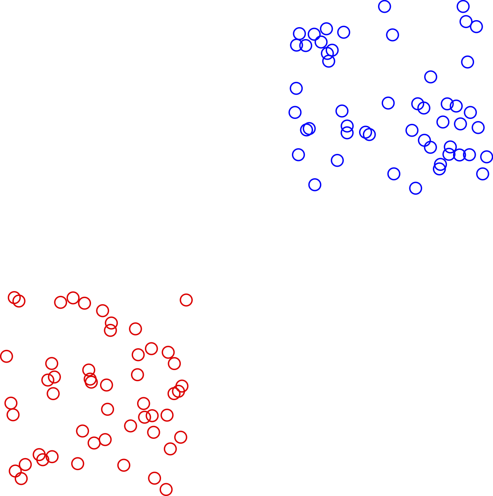
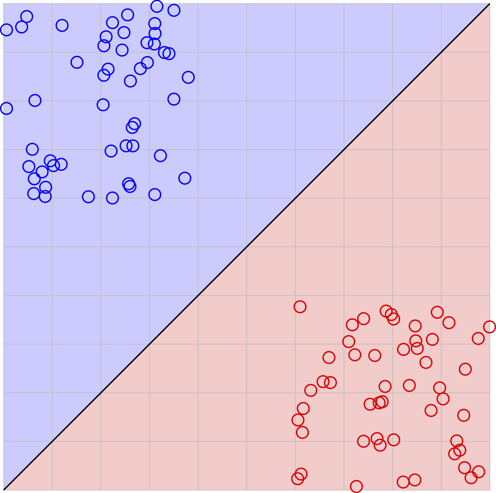

---
author:
- Maximilian Balthasar Mansky
title: 'Basic mathematics of (supervised) neural networks'
---

Neural networks have found tremendous success in classifying data sets such as images, texts and sound fragments. These networks learn the connections between a data point and its correct classification through a process called supervised learning. In this process the network is presented with a set of data points and the corresponding categorisation. Through an iterative process, the network is able to approximate the connections inherent to the data sets. In practice the connection found by the neural network generalises to other data points not in the original set; The network can correctly recognise data points
that were not in the initial set. The underlying assumption is that data points close to one of the initial data points belongs to the same category. The definition of \"close\" is loose, but it excludes cases like hash functions, where neighbouring points are in no relation in the mapping space.

A neural network is used to make a connection between a data input space
and a categorisation space. Generally, both spaces are standard vectors
space, i.e. $\mathbb{R}^n$. The data on both the input and the output
are embedded in their spaces as discrete points.[^1] The purpose of the
neural network is to find an approximation to the known map $\mathbf{T}$
that correctly maps points from the data space to the categorisation
space, meaning: $$\begin{aligned}
\mathbf{T}:&\,\phantom{\ni x_i}\mathbb{R}^f \mapsto \mathbb{R}^l\nonumber\\
\mathbf{T}:&\mathbb{R}^f \ni x_i \to y_i \in \mathbb{R}^l\end{aligned}$$
where $\mathbb{R}^f$ and $\mathbb{R}^l$ are the feature (data) and label
(categorisation) space respectively and $i$ is an index that runs over
the data points. This ideal map provides a categorisation for each
input. Consider for example data points in $\mathbb{R}^2$, as shown in the following figure.

The categorisation space is also two-dimensional, with each data point
carrying a value of either red
$(\begin{smallmatrix} 1\\0\end{smallmatrix})$ or blue
$(\begin{smallmatrix} 0\\1\end{smallmatrix})$. All of the known data
points therefore carry two sets of values, a two-dimensional position in
within the figure and a two-dimensional description that uniquely
identifies the color. This set is the known map $\mathbf{T}$. However,
this map is not very useful in practice because it can only provide
information for points that are known, it caries no information about
points outside of the set. In the given example, $\mathbf{T}$ only
contains a list of pairs of $x, y$ coordinates and the corresponding
colour and it can make no prediction about any point in the data space.
It is therefore a discontinuous map. When using a neural network to find
an approximation $T$ of the map $\mathbf{T}$, it generalises the
information given and is now able to provide information about points
that are not within the known data set.

An approximation $T$ may not be able to reproduce the clear
$(\begin{smallmatrix} 1\\0\end{smallmatrix})$ or
$(\begin{smallmatrix} 0\\1\end{smallmatrix})$ vectors as seen in the
known map. There needs to be a selection criteria to decide whether a
point $y_i = T(x_i)$ belongs to either the red or the blue category.
Since the dimension number is the criterion that decides which category
the data point belongs to, it makes sense to choose the category with
the largest value (in the case where the categories are mutually
exclusive) or where the value of the dimension is larger than a cut-off
value (meaning that potentially several categories can be chosen at the
same time). Both choices are valid even after normalisation of the
vector length. In this example, the points are categorised based on the
dimension carrying the largest value.

Now that there is a way of choosing the category, the known map
$\mathbf{T}$ can be approximated. Since both the data space and the
categorisation space are well-behaved vector-spaces, the known map can
be approximated by matrices. The approximation $T$ can be represented as
matrix $w$ and bias vector $b$ as $$
T_\text{linear}:&\mathbb{R}^f \mapsto \mathbb{R}^l\nonumber$$

$$T_\text{linear}:&\mathbb{R}^f \ni x_i \to (w x_i + b) \in \mathbb{R}^l$$
In this map, the matrix $w$ has dimensions $f \times l$ and the bias is
$l$-dimensional. In the case of example presented above, the
approximation is sufficient as the two areas of data points simply need
to be rotated to be correctly classified. This is shown in the figure below, with the areas of categorisation
drawn in.

While this solution certainly manages to separate the data, quite a
number of data points are still a large distance away from the true
value of $(\begin{smallmatrix} 1\\0 \end{smallmatrix})$ or
$(\begin{smallmatrix} 0\\1\end{smallmatrix})$. In order to improve the
agreement between the approximation $T$ and the desired outcome
$\mathbf{T}$, one introduces non-linearity. The aforementioned map
$T: x\to wx+b$ changes to $T: x\to \sigma(wx+b)$, where $\sigma$ is
called the activation function. The activation function is applied to
each entry, meaning: $$
\sigma(\vec{x}) = \sigma \begin{pmatrix} x_1 \\ x_2 \\ \vdots\\ x_n\end{pmatrix} = \begin{pmatrix} \sigma(x_1)\\ \sigma(x_2) \\\vdots\\ \sigma (x_n)\end{pmatrix}$$

There are a number of different activation functions in use. A
convenient function to use in this context is the sigmoid function
(logistic function) $\sigma(x) = 1/(1+\exp(-x))$. This function can be
used to restrict the image of the map to one that coincides with the
known labels. Values that are large are restricted to $1$ and small ones
restricted to $0$. By multiplying the matrix $w$ with a large number and
then applying the function, the function $T$ approximates the known map
$\mathbf{T}$ very well.

|---|---|
| $$
\sigma_\text{sigmoid}(x) &= \frac1{1+e^{-x}}& \begin{tikzpicture}[baseline=0cm] 
\draw[gray!20] (-2.5, 0) -- (2.5, 0);
\draw[domain=-5:5, samples=51, xscale=0.5] plot (\x, {1/(1+exp(-\x))});$$ |  |

The final approximation is shown in figure
[\[fig:finalsimplesolution\]](#fig:finalsimplesolution){reference-type="ref"
reference="fig:finalsimplesolution"}. As expected, the data points
cluster towards the ideal values of
$(\begin{smallmatrix}1\\0\end{smallmatrix})$ and
$(\begin{smallmatrix} 0\\1\end{smallmatrix})$. Also observe how the
space is stretched. The grid in figures
[\[fig:rotatedsimplesolution\]](#fig:rotatedsimplesolution){reference-type="ref"
reference="fig:rotatedsimplesolution"} and
[\[fig:finalsimplesolution\]](#fig:finalsimplesolution){reference-type="ref"
reference="fig:finalsimplesolution"} are the same, both the
$\sigma_\text{sigmoid}$ transformation stretches the space such that
$T\approx \mathbf{T}$ for the known data points $x_i$.

The solution here raises two questions: How does the computer \"know\"
how to move the points around and what happens in more complex
arrangements of data that are not linearly separable?

Error determination and matrix adjustment
=========================================

In order to find a map $T$ that approximates the known map $\mathbf{T}$
well, one needs to know the difference or rather the error between the
two. Consider some map $T: x\to \sigma(wx+b)$ as described above. For
each known data point $x_i$ that is mapped into the categorisation space
$T: x_i \to y_i \in \mathbb{R}^f$, there is a difference to the correct
categorisation $y_\text{true}$, in the example this is
$y_\text{red} = (\begin{smallmatrix} 1\\0\end{smallmatrix})$ or
$y_\text{blue} = (\begin{smallmatrix} 0\\1\end{smallmatrix})$. The error
between the predicted categorisation value $y_\text{pred} = T(x_i)$ and
the true categorisation $y_\text{true}$ can be expressed with an error
function, $E(y_\text{pred}, y_\text{true})$. The choice of the error
function depends on the problem in question, however it needs to be
differentiable. The requirement of differentiability is necessary
because one can use the derivative of the error to change both $w$ and
$b$ to yield a better approximation of the known map $\mathbf{T}$.
Consider the derivative of the error with respect to $w$:[^2]
$$\begin{aligned}
\frac{\partial E}{\partial w} = \frac{\partial E}{\partial \sigma} \frac{\partial \sigma}{\partial w}\label{eq:simpleupdate}\end{aligned}$$
Since both the error function $E$ and the activation function $\sigma$
are required to be differentiable, it is possible to obtain the gradient
for the matrix, i.e. the direction of largest change. A change of
$w_\text{new} = w - \eta \frac{\partial E}{\partial w}$, where $\eta$ is
a regulating constant (the learning rate), will reduce the error between
the current value in the categorisation space,
$y_{\text{pred}, i} = T(x_i)$ and the desired value,
$y_{\text{true}, i} = \mathbf{T}(x_i)$. Hence by going through all data
points in the training set, the neural network is able to approximate
the known map to a sufficient degree. Moreover, since $T$ is a
continuous map, it is able to make predictions about nearby points
$x+\epsilon$ close to known data points.

Layers of networks
==================

The solution presented above works well when data is linearly separable,
meaning that the data can be categorised based on rotating and
(non-linearly) stretching space.

It is obvious that stretching and warping space alone will not always
separate data points belonging to the same category. One can attempt to
correctly classify data by moving to higher or lower dimensions. This is
the idea behind layers of a network. Instead of using a single
transformation $T:\sigma(wx+b)$, several are concatenated as:
$$\begin{aligned}
T_1\circ T_2&: \mathbb{R}^f \to \mathbb{R}^n \to \mathbb{R}^l\nonumber\\
T_1\circ T_2&: x_i \in \mathbb{R}^f \mapsto x_i \in \mathbb{R}^n  \mapsto x_i \in \mathbb{R}^l\end{aligned}$$
The intermediary space $\mathbb{R}^n$ does not need to have the same
dimensionality as the surrounding ones. This allows to rotate and
stretch in higher dimensions, with restrictions. A map
$T: \mathbb{R}^m \to \mathbb{R}^n$ with $m<n$ is injective, the opposite
$T:\mathbb{R}^m \to \mathbb{R}^n$ with $m>n$ is surjective. In
particular in linear cases, $$\begin{aligned}
T_\text{linear} &:\mathbb{R}^m \to \mathbb{R}^n\nonumber\\
T_\text{linear} &: \mathbb{R}^m \ni x \mapsto wx+b \in \mathbb{R}^n\end{aligned}$$
the relative alignment of the data points $x_i$ is preserved in the new
space. Consider figure
[\[fig:transfer\]](#fig:transfer){reference-type="ref"
reference="fig:transfer"}, where a linear transfer of an arrangement of
data points is shown, as
$T:\mathbb{R}^2\to \mathbb{R}^3\to \mathbb{R}^2$, with no application of
an activation function $\sigma$. When moving from a smaller to a larger
dimension, the data points remain in a hyperplane equivalent to the
prior dimension; Coming from two to three dimensions, all data points
$x_i \in \mathbb{R}^2$ are mapped to a plane in $\mathbb{R}^3$. This is
an injective map since not all possible values in the target space
$\mathbb{R}^n$ have a source. Conversely, the map
$\mathbb{R}^m\to \mathbb{R}^n$ with $m>n$ is surjective, (infinitely)
many data points get projected to the same data point in the target
space.

The second, surjective case appears very often in real-life applications
of neural networks. Generally, there is a large disparity between the
amount of data that is input into the neural networks and the number of
classifications of that data. By effectively projecting down a huge
number of dimensions to the classifications, it becomes possible to
create a map that correctly classifies the original data points $x_i$
but also generalises to points $x_i + \epsilon$.

This concept of iterating the map $T$ by passing through different
vector spaces is of course not limited to length $2$. The concept of
\"deep\" neural networks refer to the fact that there are many layers to
a neural network. Deep neural networks can discern categories based on
increasingly complex relations.

Error propagation through many-layered neural networks
------------------------------------------------------

With more layers, there are also more matrices to updated. While the
last layer can be updated as shown in equation
[\[eq:simpleupdate\]](#eq:simpleupdate){reference-type="eqref"
reference="eq:simpleupdate"}, layers before that need to change
depending on the following layer. The gradient update propagates
backwards through the layers in a process termed \"backpropagation\".
The update of a layer $T_n$ is calculated with respect to the derivative
of the next layer $T_{n+1}$.

[^1]: In time-dependent or serial data, the dimension is
    $\mathbb{R}^n\times \mathbb{R}^1$, with the data being discretised
    curves or connected points.

[^2]: The derivation for the bias vector $b$ is analogous.
